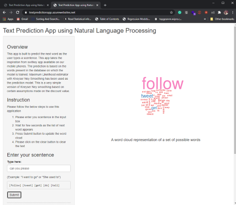

```{r setup, include=FALSE}
knitr::opts_chunk$set(echo = FALSE)
```

## Overview

- This project aims to build a product which can predict the next word as the user starts typing words.
- In this capstone we will be applying data science in the area of natural language processing. 
- The language model is applied on a small percentage of corpus which is scrapped from News, twitter and blogs.
- I have used Maximum Likelihood estimator with Kneyser Ney Smoothing for the prediction.


## Language Modelling

- Kneser-Ney smoothing is an algorithm designed to adjust the weights (through discounting) by using the continuation counts of lower n-grams. 

- Given the sentence, “Francisco”" is presented as the suggested ending, because it appears more often than “glasses” in some text.

>`I can’t see without my reading… __ Francisco __`

- However, even though “Francisco” appears more often than “glasses”, “Francisco” rarely occurs outside of the context of “San Francisco”. Thus, instead of observing how often a word appears, the Kneser-Ney algorithm takes into account how often a word completes a bigram type (e.g., “prescription glasses”, “reading glasses”, “small glasses” vs. “San Francisco”). 

## Shiny Application

This is an overview of the application UI, which takes user input and returns top 5 predicted words as a result and creates a word cloud on the main panel.

[Link to the application]()  

 

## Conclusion

This was a significant educational experience in handling and processing large textual data. This model is working fine in the context of known words and need improvement in case of words out of vocabulary. There is a lot work needs to be done in optimising the model accuracy and execution time. This was my simple take on kneser kney algorithm in a full recursive manner. I learned how to explore algorithms to optimize predictive power.

References:   

- [Natural language processing](https://en.wikipedia.org/wiki/Natural_language_processing)  
- [Text mining infrastucture in R](http://www.jstatsoft.org/v25/i05/)
- [Natural Language Processing](http://cran.r-project.org/web/views/NaturalLanguageProcessing.html)
- [Language Modelling by Dan Jurafsky](http://web.stanford.edu/class/cs124/lec/languagemodeling.pdf)
- [Kneyser Kney Smoothing](https://en.wikipedia.org/wiki/Kneser%E2%80%93Ney_smoothing)
